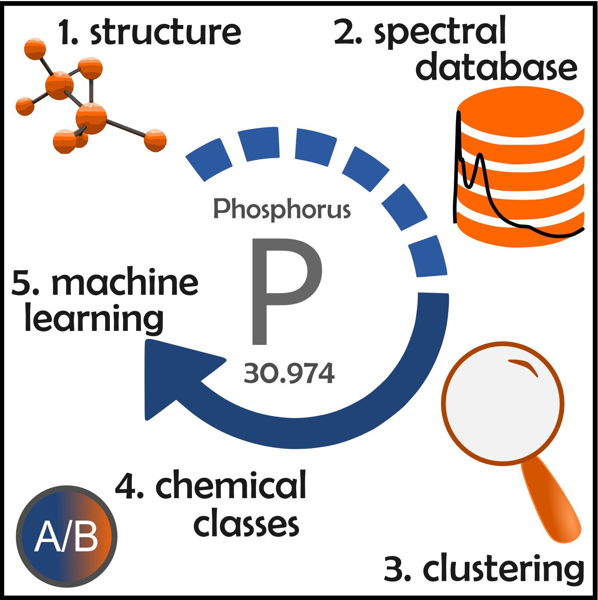

# Phosphorus Machine Learning Project

This repository contains the analysis of Valence to Core X-ray Emission Spectroscopy (VTC-XES) and X-ray Absoprtion Near-Edge Structure (XANES) spectra belonging to over 1000 organic phosphorus compounds. We implement various unsupervised machine learning techniques and visualization tools in Jupyter notebooks.

#### Authors: Samantha Tetef and Vikram Kashyap

## Abstract

We analyze an ensemble of phosphorganics to understand the full extent of information encoded in their X-ray absorption near edge structure (XANES) and valence-to-core X-ray emission spectra (XES). We develop an analysis framework that utilizes data-driven development of chemical classes via unsupervised machine learning, specifically cluster analysis in the Uniform Manifold Approximation and Projection (UMAP) embedding. These cluster-informed classes indicate spectral sensitivity to coordination, oxidation, aromaticity, intramolecular hydrogen bonding, and ligand identity. Subsequently, we implement supervised machine learning via gaussian process classifiers, which identify confidence in predictions that match our initial qualitative assessments of clustering, further supporting the benefit of using unsupervised machine learning as a precursor to predictions via supervised machine learning. Finally, we develop an open-source python module that allows for efficient and customizable management of molecular structure datasets.

## Pipeline

## Structure

All spectral data is located in:

1. `ProcessedData/`

The `ProcessedData` directory has .dat files, formatted as CID_xes.dat or CID_xanes.dat, along with each data file's respective .processedspectrum file, which are obtained from broadening the dipole transitions in the .dat files.

All metedata belong to individual compounds is located in:

2. `Database/`

The `Database` directory has .jmf files named by the PubChem compound identification number (CID). The database is managed by our package `moldl`. See [github.com/vikramkashyap/moldl](https://github.com/vikramkashyap/moldl) for the `moldl` repository.