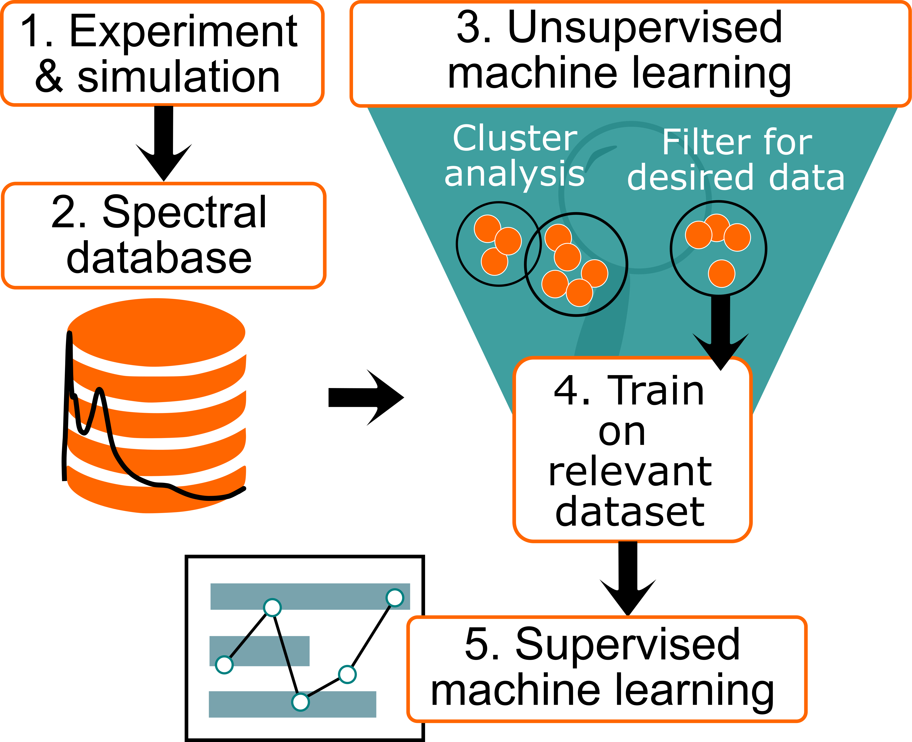

# Phosphorus Machine Learning Project

This repository contains the analysis of Valence to Core X-ray Emission Spectroscopy (VTC-XES) and X-ray Absoprtion Near-Edge Structure (XANES) spectra belonging to over 1000 organic phosphorus compounds. We implement various unsupervised machine learning techniques and visualization tools in Jupyter notebooks.

#### Authors: Samantha Tetef and Vikram Kashyap

This research appeared in the following:
[*Journal of Physical Chemistry A*, doi.org:10.1021/acs.jpca.2c03635](https://doi.org/10.1021/acs.jpca.2c03635)
[ChemRxiv](https://chemrxiv.org/engage/chemrxiv/article-details/621402950c0bf00f69f1ac0c)

## Abstract

We analyze an ensemble of organophosphorus compounds to form an unbiased characterization of the information encoded in their X-ray absorption near edge structure (XANES) and valence-to-core X-ray emission spectra (VtC-XES). Data-driven emergence of chemical classes via unsupervised machine learning, specifically cluster analysis in the Uniform Manifold Approximation and Projection (UMAP) embedding, finds spectral sensitivity to coordination, oxidation, aromaticity, intramolecular hydrogen bonding, and ligand identity. Subsequently, we implement supervised machine learning via Gaussian Process classifiers to identify confidence in predictions which match our initial qualitative assessments of clustering. The results further support the benefit of utilizing unsupervised machine learning as a precursor to supervised machine learning, which we term Unsupervised Validation of Classes (UVC), a result that goes beyond the present case of X-ray spectroscopies.

## Pipeline

## Structure

All spectral data is located in:

1. `ProcessedData/`

The `ProcessedData` directory has .dat files, formatted as CID_xes.dat or CID_xanes.dat, along with each data file's respective .processedspectrum file, which are obtained from broadening the dipole transitions in the .dat files.

All metedata belong to individual compounds is located in:

2. `Database/`

The `Database` directory has .jmf files named by the PubChem compound identification number (CID). The database is managed by our package `moldl`. See [github.com/vikramkashyap/moldl](https://github.com/vikramkashyap/moldl) for the `moldl` repository.
